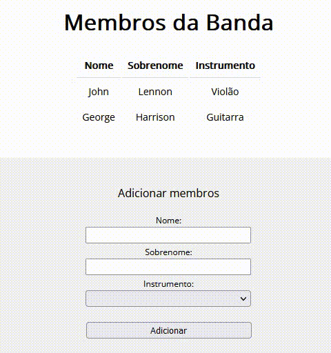

# Cadastro-formulario-VUE

O projeto é baseado no cadastro de integrantes de uma banda , os dados são pegos do formulário e inseridos em um objeto e inserindos nos elementos html, utilizando o v-model

## Tecnologias utilizadas

<ul>
  <li>HTML5</li>
  <li>CSS3</li>
  <li>Javascript</li>
  <li>Vue.js</li>
</ul>

## Screenshot

